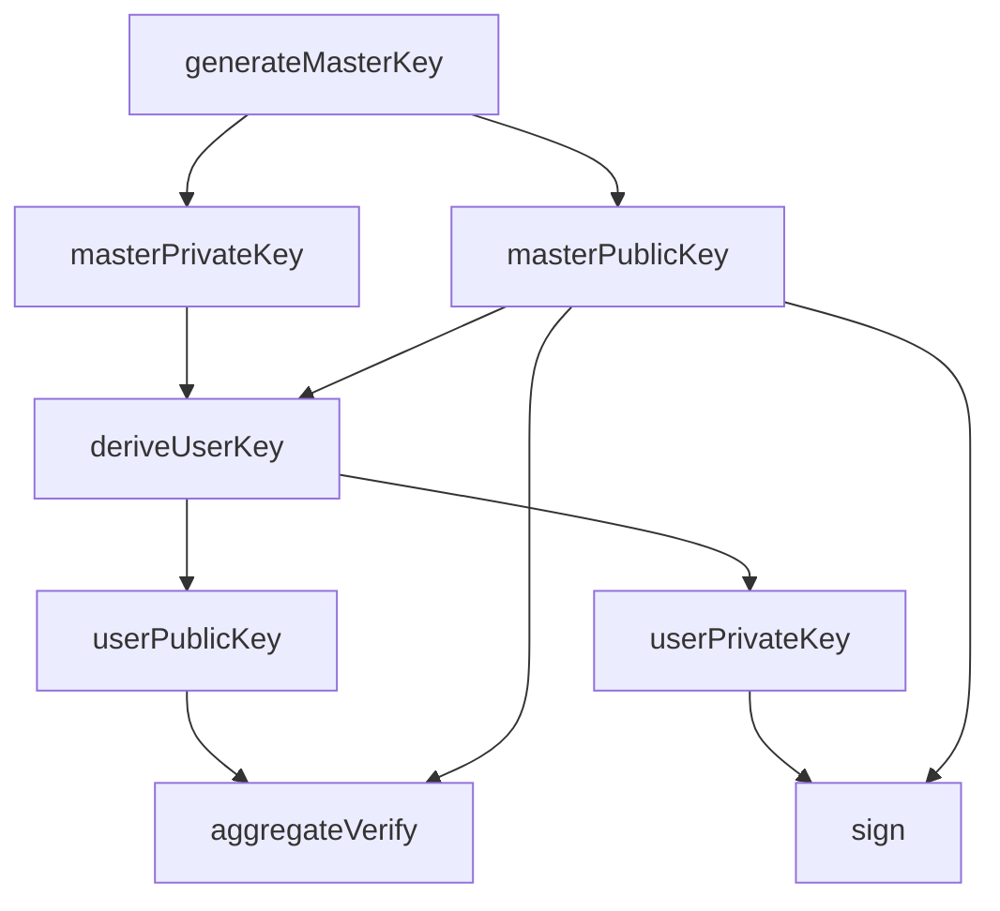

# IdentityAlgorithmTemplate

A template repository for implementing custom identity signing algorithms as shared-library plugins for the [ChordAuditMatrix](https://github.com/ChordAuditMatrix/ChordAuditMatrix) system.

## Overview

ChordAuditMatrix uses a **hot-load** architecture: identity algorithms are compiled as shared libraries (`.so` / `.dylib`) and loaded at runtime via `dlopen`/`dlsym`. This template provides a ready-to-build skeleton that you can fork, implement, and drop into the system.

The template depends on [CoreLib](https://github.com/ChordAuditMatrix/CoreLib), which is included as a git submodule and provides the base interface, parameter types, and cryptographic primitives.

## Architecture

Identity signing algorithms implement a **two-tier key hierarchy** with two core operations:

```
┌────────────────────────────────────────────────────┐
│  Master Key Generation                              │
│  generateMasterKey() → (masterPublicKey, masterPrivateKey)  │
├────────────────────────────────────────────────────┤
│  User Key Derivation                                │
│  deriveUserKey(mpk, msk, userId)                    │
│    → (userPublicKey, userPrivateKey)                │
├────────────────────────────────────────────────────┤
│  Sign                                               │
│  sign(message, userPrivateKey, masterPublicKey)     │
│    → signature                                      │
├────────────────────────────────────────────────────┤
│  Aggregate Verify                                   │
│  aggregateVerify(aggSignature, message, signers, mpk)│
│    → bool                                           │
└────────────────────────────────────────────────────┘
```

### Key Hierarchy



## Quick Start

### 1. Clone with Submodules

```bash
git clone --recurse-submodules git@github.com:ChordAuditMatrix/IdentityAlgorithmTemplate.git
cd IdentityAlgorithmTemplate
```

If you already cloned without `--recurse-submodules`:

```bash
git submodule update --init --recursive
```

### 2. Build

```bash
mkdir build.nosync && cd build.nosync
cmake .. -DCMAKE_BUILD_TYPE=Debug -G Ninja
cmake --build . -j$(nproc)
```

This produces `libIdentityAlgorithmTemplate.so` (or `.dylib` on macOS).

### 3. Install into ChordAuditMatrix

Copy the shared library to the identity algorithm plugin directory configured in your ChordAuditMatrix deployment:

```bash
cp libIdentityAlgorithmTemplate.so /path/to/chordauditmatrix/plugins/
```

The `AlgorithmHotLoadDecorator` will discover it via the C-linkage factory functions.

## Implementing Your Algorithm

### Base Class

Inherit from `CAMatrix::Identity::Core::IdentitySigningAlgorithm`.

### Required Methods

| Method | Description | Returns |
|--------|-------------|---------|
| `algorithmType()` | Unique algorithm identifier (e.g., `"MyIdentity"`) | `std::string` |
| `version()` | Semantic version string | `std::string` |
| `generateMasterKey()` | Generate master key pair (mpk, msk) | `pair<AlgoPublicParamsPtr, AlgoPrivateParamsPtr>` |
| `deriveUserKey(mpk, msk, userId)` | Derive user key pair from master key | `pair<AlgoUserPublicParamsPtr, AlgoUserPrivateParamsPtr>` |
| `sign(req)` | Sign a message with user's private key | `CryptoArray` |
| `aggregateVerify(req)` | Verify an aggregate signature | `bool` |
| `createRequest(op, input)` | Convert `AuditDataMap` → typed Request | `IdentityRequestVariantPtr` |
| `createPublicParams()` | Factory for deserializing master public params | `shared_ptr<AlgoPublicParams>` |
| `createPrivateParams()` | Factory for deserializing master private params | `shared_ptr<AlgoPrivateParams>` |
| `createUserPublicParams()` | Factory for deserializing user public params | `shared_ptr<AlgoUserPublicParams>` |
| `createUserPrivateParams()` | Factory for deserializing user private params | `shared_ptr<AlgoUserPrivateParams>` |

### C-Linkage Factory Functions

Every plugin shared library **must** export these two symbols:

```cpp
extern "C" CAMatrix::Identity::Core::IdentitySigningAlgorithm* create_identity_algorithm() noexcept
{
    return new YourAlgorithm();
}

extern "C" void destroy_identity_algorithm(CAMatrix::Identity::Core::IdentitySigningAlgorithm* p) noexcept
{
    delete p;
}
```

These are resolved by `AlgorithmHotLoadDecorator` at load time via `dlsym`, using the factory symbol names `"create_identity_algorithm"` and `"destroy_identity_algorithm"`.

### Key Management

Identity algorithms use a **two-tier key hierarchy**:

1. **Master key pair** — Generated once per algorithm instance by `generateMasterKey()`. The master private key is held by the KGC (Key Generation Center); the master public key is distributed to all participants.

2. **User key pair** — Derived by `deriveUserKey(masterPub, masterPriv, userId)`. Each user's private key is computed from the master private key and their identity string; the user's public key can be derived from the master public key and the user ID.

### Request / Result Types

There are two operations and two corresponding request types:

| Operation | Request | Description |
|-----------|---------|-------------|
| `IdentityOperation::Sign` | `SignRequest` | Contains: message, userId, userPrivateKey, masterPublicKey |
| `IdentityOperation::Verify` | `AggregateVerifyRequest` | Contains: aggregateSignature, message, signers list, masterPublicKey |

The `createRequest()` method converts an `AuditDataMap` (key-value map) into a typed request struct based on the `IdentityOperation` enum.

### Parameter Factory Methods

The four `create*Params()` methods are used for **deserialization**. When the system receives serialized algorithm parameters (e.g., from a database or network), it calls these factory methods to create empty parameter objects, then deserializes into them via `do_deserialize()`.

You must implement concrete subclasses of the four abstract parameter types:

| Abstract Base | Your Concrete Class | Contains |
|---------------|---------------------|----------|
| `AlgoPublicParams` | e.g., `MyPublicParams` | Master public key data |
| `AlgoPrivateParams` | e.g., `MyPrivateParams` | Master private key data |
| `AlgoUserPublicParams` | e.g., `MyUserPublicParams` | User public key data |
| `AlgoUserPrivateParams` | e.g., `MyUserPrivateParams` | User private key data |

Each concrete class must implement `do_serialize()` and `do_deserialize()` from `CryptoSerializable`.

## CMake Options

| Option | Default | Description |
|--------|---------|-------------|
| `CAM_BUILD_BENCHMARK` | `OFF` | Build benchmarks |
| `CAM_BUILD_TESTS` | `OFF` | Build tests |
| `CAM_GENERATE_DOCS` | `OFF` | Generate Doxygen documentation |

Options propagate automatically via CMake cache — no `CACHE FORCE` needed.

## Project Structure

```
IdentityAlgorithmTemplate/
├── CMakeLists.txt
├── README.md
├── .gitignore
├── .gitmodules
├── .cmake/
│   └── Doxyfile.in
├── 3rdparty/
│   └── CoreLib/          ← git submodule
├── include/
│   └── NewIdentityAlgorithm/
│       └── new_identity_algorithm.h
└── source/
    └── new_identity_algorithm.cpp
```

## License

GPL-3.0-or-later — see [LICENSE](LICENSE).
